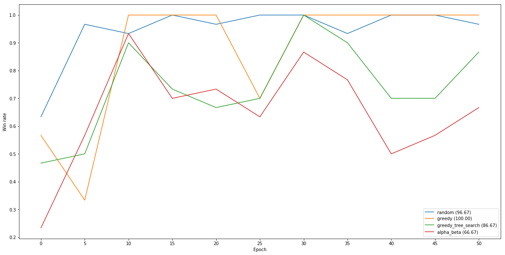

# Othello RL
An implementation of self-play reinforcement learning algorithm for 8x8 Othello. The algorithm uses
Monte Carlo Tree Search to improve it's policy in every turn and then updates the policy so that
actions taken by MCTS have higher probability if they led to winning the game.

### Results
The agent was trained for approximately 13 hours on a node with 32 CPU cores. In every iteration it
played 96 games against a randomly sampled version of past agent parameters. 30 MCTS traversals per
turn were used and the game tree was reset after every game. To update agent parameters I used clipped
PPO loss.

